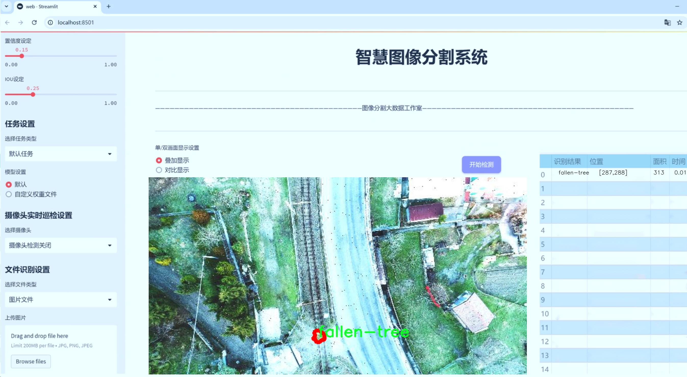
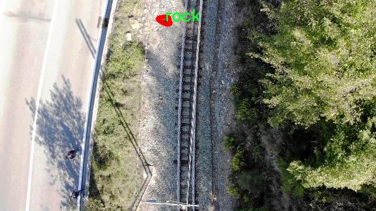

# 无人机航拍铁路障碍物识别图像分割系统源码＆数据集分享
 [yolov8-seg-C2f-FocusedLinearAttention＆yolov8-seg-RepHGNetV2等50+全套改进创新点发刊_一键训练教程_Web前端展示]

### 1.研究背景与意义

项目参考[ILSVRC ImageNet Large Scale Visual Recognition Challenge](https://gitee.com/YOLOv8_YOLOv11_Segmentation_Studio/projects)

项目来源[AAAI Global Al lnnovation Contest](https://kdocs.cn/l/cszuIiCKVNis)

研究背景与意义

随着城市化进程的加快，铁路运输作为一种高效、环保的交通方式，其安全性和可靠性日益受到重视。铁路沿线的障碍物，如倒下的树木、岩石等，可能对列车的正常运行构成严重威胁。因此，及时、准确地识别和处理这些障碍物，成为保障铁路安全的重要环节。传统的人工巡检方法不仅效率低下，而且容易受到天气、光照等因素的影响，难以保证检测的全面性和准确性。近年来，随着无人机技术的迅猛发展，利用无人机进行铁路巡检已成为一种新兴的解决方案。无人机能够在短时间内覆盖大面积的铁路区域，并通过搭载高分辨率摄像头获取实时图像，为障碍物的识别提供了丰富的数据基础。

在图像处理领域，目标检测与图像分割技术的快速发展，为铁路障碍物的自动识别提供了新的可能性。YOLO（You Only Look Once）系列模型因其高效的实时检测能力而受到广泛关注。YOLOv8作为该系列的最新版本，进一步提升了检测精度和速度，适用于复杂环境下的目标识别任务。然而，现有的YOLOv8模型在特定场景下的障碍物识别效果仍有待提升，尤其是在多类障碍物的精确分割方面。因此，基于改进YOLOv8的无人机航拍铁路障碍物识别图像分割系统的研究，具有重要的理论价值和实际意义。

本研究的核心在于构建一个针对铁路障碍物的实例分割系统，利用无人机获取的图像数据，识别和分割出不同类别的障碍物，包括倒下的树木、岩石等。通过对1200幅图像的训练，结合四类障碍物的特征，优化YOLOv8模型的结构与参数，提升其在复杂场景下的识别能力。此研究不仅有助于提高铁路巡检的自动化水平，降低人工成本，还能显著提升铁路安全管理的效率。

此外，本研究还将推动无人机技术与深度学习的结合，探索其在其他领域的应用潜力。通过建立一个高效的铁路障碍物识别系统，能够为后续的智能交通、环境监测等相关研究提供数据支持和技术参考。同时，该系统的成功应用，将为铁路部门提供实时的障碍物监测与预警机制，降低因障碍物导致的事故风险，保障铁路运输的安全性与可靠性。

综上所述，基于改进YOLOv8的无人机航拍铁路障碍物识别图像分割系统的研究，不仅具有重要的学术价值，还能为实际应用提供切实可行的解决方案，推动铁路安全管理的智能化进程。通过这一研究，期望能够为铁路运输的安全运营提供有力保障，为未来的智能交通系统建设奠定基础。

### 2.图片演示





##### 注意：由于此博客编辑较早，上面“2.图片演示”和“3.视频演示”展示的系统图片或者视频可能为老版本，新版本在老版本的基础上升级如下：（实际效果以升级的新版本为准）

  （1）适配了YOLOV8的“目标检测”模型和“实例分割”模型，通过加载相应的权重（.pt）文件即可自适应加载模型。

  （2）支持“图片识别”、“视频识别”、“摄像头实时识别”三种识别模式。

  （3）支持“图片识别”、“视频识别”、“摄像头实时识别”三种识别结果保存导出，解决手动导出（容易卡顿出现爆内存）存在的问题，识别完自动保存结果并导出到tempDir中。

  （4）支持Web前端系统中的标题、背景图等自定义修改，后面提供修改教程。

  另外本项目提供训练的数据集和训练教程,暂不提供权重文件（best.pt）,需要您按照教程进行训练后实现图片演示和Web前端界面演示的效果。

### 3.视频演示

[3.1 视频演示](https://www.bilibili.com/video/BV1XuS7YeEpN/)

### 4.数据集信息展示

##### 4.1 本项目数据集详细数据（类别数＆类别名）

nc: 4
names: ['fallen-tree', 'generic-rock', 'generic-tree', 'rock']


##### 4.2 本项目数据集信息介绍

数据集信息展示

在本研究中，我们构建了一个名为“Railway Obstacles”的数据集，旨在为改进YOLOv8-seg的无人机航拍铁路障碍物识别图像分割系统提供高质量的训练数据。该数据集专注于铁路环境中的障碍物识别，尤其是那些可能对铁路运输安全构成威胁的自然物体。数据集的设计考虑到了铁路沿线常见的障碍物类型，确保能够涵盖多样化的场景和条件，以提高模型的泛化能力和识别准确性。

“Railway Obstacles”数据集包含四个主要类别，分别是：倒下的树（fallen-tree）、普通岩石（generic-rock）、普通树（generic-tree）和岩石（rock）。这些类别的选择基于对铁路沿线环境的深入分析，考虑了不同类型障碍物对铁路运营的潜在影响。倒下的树和普通树代表了植被类障碍物，这些障碍物在风暴或自然灾害后可能会对铁路造成直接威胁。普通岩石和岩石则是地质类障碍物，常见于铁路沿线的山坡或开挖区域，可能因土壤侵蚀或地质活动而滚落到轨道上。

数据集的构建过程包括从不同的无人机航拍图像中提取样本，确保每个类别的样本数量均衡且多样化。为了增强数据集的代表性，我们在不同的季节、天气条件和时间段内收集了图像，以捕捉到不同光照和环境变化对障碍物识别的影响。此外，数据集中还包含了多种角度和距离的图像，确保模型能够在不同的视角下进行有效的识别和分割。

每个图像都经过精确的标注，使用多边形标注工具对障碍物进行分割，确保模型能够学习到每个障碍物的具体形状和边界。这种精细的标注方式不仅提高了模型的训练效果，也为后续的测试和评估提供了可靠的基准。数据集中的图像分辨率和质量经过严格控制，以保证在训练过程中能够充分利用图像信息，从而提升模型的性能。

为了进一步提升模型的鲁棒性和适应性，我们还计划在数据集中引入一些合成数据，模拟不同的光照条件和气候变化。这将有助于模型在实际应用中应对复杂多变的环境，提高其在真实场景中的表现。

总之，“Railway Obstacles”数据集的构建为改进YOLOv8-seg的无人机航拍铁路障碍物识别图像分割系统提供了坚实的基础。通过精心设计的类别、丰富的样本和高质量的标注，我们期望该数据集能够有效支持模型的训练，最终实现对铁路障碍物的高效、准确识别。这不仅有助于提升铁路运输的安全性，也为无人机在智能交通领域的应用提供了新的思路和方向。




### 5.全套项目环境部署视频教程（零基础手把手教学）

[5.1 环境部署教程链接（零基础手把手教学）](https://www.bilibili.com/video/BV1jG4Ve4E9t/?vd_source=bc9aec86d164b67a7004b996143742dc)


[5.2 安装Python虚拟环境创建和依赖库安装视频教程链接（零基础手把手教学）](https://www.bilibili.com/video/BV1nA4VeYEze/?vd_source=bc9aec86d164b67a7004b996143742dc)

### 6.手把手YOLOV8-seg训练视频教程（零基础小白有手就能学会）

[6.1 手把手YOLOV8-seg训练视频教程（零基础小白有手就能学会）](https://www.bilibili.com/video/BV1cA4VeYETe/?vd_source=bc9aec86d164b67a7004b996143742dc)


按照上面的训练视频教程链接加载项目提供的数据集，运行train.py即可开始训练



     Epoch   gpu_mem       box       obj       cls    labels  img_size
     1/200     0G   0.01576   0.01955  0.007536        22      1280: 100%|██████████| 849/849 [14:42<00:00,  1.04s/it]
               Class     Images     Labels          P          R     mAP@.5 mAP@.5:.95: 100%|██████████| 213/213 [01:14<00:00,  2.87it/s]
                 all       3395      17314      0.994      0.957      0.0957      0.0843

     Epoch   gpu_mem       box       obj       cls    labels  img_size
     2/200     0G   0.01578   0.01923  0.007006        22      1280: 100%|██████████| 849/849 [14:44<00:00,  1.04s/it]
               Class     Images     Labels          P          R     mAP@.5 mAP@.5:.95: 100%|██████████| 213/213 [01:12<00:00,  2.95it/s]
                 all       3395      17314      0.996      0.956      0.0957      0.0845

     Epoch   gpu_mem       box       obj       cls    labels  img_size
     3/200     0G   0.01561    0.0191  0.006895        27      1280: 100%|██████████| 849/849 [10:56<00:00,  1.29it/s]
               Class     Images     Labels          P          R     mAP@.5 mAP@.5:.95: 100%|███████   | 187/213 [00:52<00:00,  4.04it/s]
                 all       3395      17314      0.996      0.957      0.0957      0.0845


### 7.50+种全套YOLOV8-seg创新点代码加载调参视频教程（一键加载写好的改进模型的配置文件）

[7.1 50+种全套YOLOV8-seg创新点代码加载调参视频教程（一键加载写好的改进模型的配置文件）](https://www.bilibili.com/video/BV1Hw4VePEXv/?vd_source=bc9aec86d164b67a7004b996143742dc)

### 8.YOLOV8-seg图像分割算法原理

原始YOLOv8-seg算法原理

YOLOv8-seg算法是YOLO系列的最新进展，专注于目标检测与分割任务，结合了YOLOv8的高效特征提取能力与图像分割的精细化处理。其设计理念是通过对输入图像进行深度学习，提取出有用的特征，并在此基础上实现高效的目标检测和实例分割。该算法的核心在于其网络结构的创新，主要包括Backbone、Neck和Head三个部分。

在Backbone部分，YOLOv8-seg采用了CSPDarknet结构，这是一种高效的特征提取网络。CSPDarknet通过将特征图分为多个分支，利用残差连接和瓶颈结构，极大地提高了特征提取的效率和模型的性能。与前代模型相比，YOLOv8-seg引入了C2f模块，这一模块的设计使得特征图的处理更加灵活。具体而言，C2f模块将输入特征图分为两个分支，分别经过卷积层进行降维处理，然后再将两个分支的输出进行融合。这种结构不仅增加了特征图的维度，还有效地增强了梯度流的信息，使得模型在训练过程中能够更好地捕捉到重要的特征。

在特征提取的过程中，YOLOv8-seg还引入了快速空间金字塔池化（SPPF）模块。这一模块的作用是提取不同尺度的特征，尤其是在处理复杂场景时，能够有效地减少模型的参数量和计算量，同时提高特征提取的效率。通过这种多尺度特征提取的方式，YOLOv8-seg能够更好地适应不同大小和形状的目标，从而提升检测的准确性。

接下来是Neck部分，YOLOv8-seg采用了特征金字塔网络（FPN）与路径聚合网络（PAN）的结合。这一结构通过多层次的特征融合，能够有效地捕捉来自不同尺度的目标信息。Neck部分的设计使得模型能够在不同的特征层之间进行信息传递，从而增强了模型对小目标和大目标的检测能力。这种多尺度特征融合的策略，不仅提高了目标检测的性能，还增强了模型的鲁棒性，使其在复杂环境下依然能够保持良好的表现。

最后，YOLOv8-seg的Head部分负责最终的目标检测和分类任务。该部分设有多个检测头，能够在不同的尺寸信息下进行目标检测。每个检测头由一系列卷积层和反卷积层组成，负责生成最终的检测结果。在YOLOv8-seg中，采用了一种无锚框（Anchor-Free）的检测方式，直接预测目标的中心点和宽高比例。这一创新显著减少了对Anchor框的依赖，提高了检测速度和准确度。

YOLOv8-seg的训练过程也得益于其新的Pytorch训练和部署框架，使得自定义模型的训练变得更加方便。这一框架的引入，不仅提升了模型的灵活性，还使得研究人员和开发者能够更容易地进行模型的调整和优化。

总的来说，YOLOv8-seg算法通过创新的网络结构和高效的特征提取机制，实现了目标检测与分割的高效融合。其在处理复杂场景时的表现，得益于多尺度特征融合和无锚框检测的设计，使得模型在速度和准确性上都取得了显著的提升。随着YOLOv8-seg的不断发展与完善，未来在智能监控、自动驾驶、医疗影像等领域的应用前景将更加广阔。


### 9.系统功能展示（检测对象为举例，实际内容以本项目数据集为准）

图9.1.系统支持检测结果表格显示

  图9.2.系统支持置信度和IOU阈值手动调节

  图9.3.系统支持自定义加载权重文件best.pt(需要你通过步骤5中训练获得)

  图9.4.系统支持摄像头实时识别

  图9.5.系统支持图片识别

  图9.6.系统支持视频识别

  图9.7.系统支持识别结果文件自动保存

  图9.8.系统支持Excel导出检测结果数据


### 10.50+种全套YOLOV8-seg创新点原理讲解（非科班也可以轻松写刊发刊，V11版本正在科研待更新）

#### 10.1 由于篇幅限制，每个创新点的具体原理讲解就不一一展开，具体见下列网址中的创新点对应子项目的技术原理博客网址【Blog】：


[10.1 50+种全套YOLOV8-seg创新点原理讲解链接](https://gitee.com/qunmasj/good)

#### 10.2 部分改进模块原理讲解(完整的改进原理见上图和技术博客链接)【如果此小节的图加载失败可以通过CSDN或者Github搜索该博客的标题访问原始博客，原始博客图片显示正常】

### YOLOv8模型
YOLOv8模型由Ultralytics团队在YOLOv5模型的基础上，吸收了近两年半来经过实际验证的各种改进，于2023年1月提出。与之前的一些YOLO 系列模型想类似，YOLOv8模型也有多种尺寸，下面以YOLOv8n为例，分析 YOLOv8模型的结构和改进点。YOLOv8模型网络结构如
输入图片的部分，由于发现Mosaic数据增强尽管这有助于提升模型的鲁棒性和泛化性，但是，在一定程度上，也会破坏数据的真实分布，使得模型学习到一些不好的信息。所以YOLOv8模型在训练中的最后10个epoch 停止使用Mosaic数据增强。


在网络结构上，首先主干网络的改变不大，主要是将C3模块替换为了C2f模块，该模块的结构在上图中已示出。C2f模块在C3模块的思路基础上，引入了YOLOv7中 ELAN的思路，引入了更多的跳层连接，这有助于该模块获得更丰富的梯度流信息，而且模型的轻量化得到了保证。依然保留了SPPF，效果不变的同时减少了该模块的执行时间。
在颈部网络中，也是将所有的C3模块更改为C2f模块，同时删除了两处上采样之前的卷积连接层。
在头部网络中，采用了YOLOX中使用的解耦头的思路，两条并行的分支分别提取类别和位置特征。由于分类任务更注重于分析特征图中提取到的特征与已输入图片的部分，由于发现 Mosaic数据增强尽管这有助于提升模型的鲁棒性和泛化性，但是，在一定程度上，也会破坏数据的真实分布，使得模型学习到一些不好的信息。所以YOLOv8模型在训练中的最后10个epoch停止使用Mosaic数据增强。
在网络结构上，首先主干网络的改变不大，主要是将C3模块替换为了C2f模块，该模块的结构在上图中已示出。C2f模块在C3模块的思路基础上，引入了YOLOv7中ELAN的思路，引入了更多的跳层连接，这有助于该模块获得更丰富的梯度流信息，而且模型的轻量化得到了保证。依然保留了SPPF，效果不变的同时减少了该模块的执行时间。
在颈部网络中，也是将所有的C3模块更改为C2f模块，同时删除了两处上采样之前的卷积连接层。
在头部网络中，采用了YOLOX中使用的解耦头的思路，两条并行的分支分别提取类别和位置特征。由于分类任务更注重于分析特征图中提取到的特征与已有类别中的哪一种更为相似，而定位任务更关注边界框与真值框的位置关系，并据此对边界框的坐标进行调整。侧重点的不同使得在使用两个检测头时收敛的速度和预测的精度有所提高。而且使用了无锚框结构，直接预测目标的中心，并使用TAL (Task Alignment Learning，任务对齐学习）来区分正负样本，引入了分类分数和IOU的高次幂乘积作为衡量任务对齐程度的指标，认为同时拥有好的定位和分类评价的在分类和定位损失函数中也引入了这项指标。
在模型的检测结果上，YOLOv8模型也取得了较好的成果，图为官方在coCO数据集上 YOLOv8模型的模型尺寸大小和检测的mAP50-95对比图。mAP50-95指的是IOU的值从50%取到95%，步长为5%，然后算在这些IOU下的mAP的均值。图的 a）图展示了YOLOv8在同尺寸下模型中参数没有较大增加的前提下取得了比其他模型更好的精度，图2-17的b)图展示了YOLOv8比其他YOLO系列模型在同尺寸时，推理速度更快且精度没有太大下降。


### 视觉transformer(ViT)简介
视觉transformer(ViT)最近在各种计算机视觉任务中证明了巨大的成功，并受到了相当多的关注。与卷积神经网络(CNNs)相比，ViT具有更强的全局信息捕获能力和远程交互能力，表现出优于CNNs的准确性，特别是在扩大训练数据大小和模型大小时[An image is worth 16x16 words: Transformers for image recognition at scale,Coatnet]。

尽管ViT在低分辨率和高计算领域取得了巨大成功，但在高分辨率和低计算场景下，ViT仍不如cnn。例如，下图(左)比较了COCO数据集上当前基于cnn和基于vit的一级检测器。基于vit的检测器(160G mac)和基于cnn的检测器(6G mac)之间的效率差距超过一个数量级。这阻碍了在边缘设备的实时高分辨率视觉应用程序上部署ViT。


左图:现有的基于vit的一级检测器在实时目标检测方面仍然不如当前基于cnn的一级检测器，需要的计算量多出一个数量级。本文引入了第一个基于vit的实时对象检测器来弥补这一差距。在COCO上，efficientvit的AP比efficientdet高3.8，而mac较低。与YoloX相比，efficient ViT节省67.2%的计算成本，同时提供更高的AP。

中:随着输入分辨率的增加，计算成本呈二次增长，无法有效处理高分辨率的视觉应用。

右图:高分辨率对图像分割很重要。当输入分辨率从1024x2048降低到512x1024时，MobileNetV2的mIoU减少12% (8.5 mIoU)。在不提高分辨率的情况下，只提高模型尺寸是无法缩小性能差距的。

ViT的根本计算瓶颈是softmax注意模块，其计算成本随输入分辨率的增加呈二次增长。例如，如上图(中)所示，随着输入分辨率的增加，vit- small[Pytorch image models. https://github.com/rwightman/ pytorch-image-models]的计算成本迅速显著大于ResNet-152的计算成本。

解决这个问题的一个直接方法是降低输入分辨率。然而，高分辨率的视觉识别在许多现实世界的计算机视觉应用中是必不可少的，如自动驾驶，医疗图像处理等。当输入分辨率降低时，图像中的小物体和精细细节会消失，导致目标检测和语义分割性能显著下降。

上图(右)显示了在cityscape数据集上不同输入分辨率和宽度乘法器下MobileNetV2的性能。例如，将输入分辨率从1024x2048降低到512x1024会使cityscape的性能降低12% (8.5 mIoU)。即使是3.6倍高的mac，只放大模型尺寸而不增加分辨率也无法弥补这一性能损失。

除了降低分辨率外，另一种代表性的方法是限制softmax注意，方法是将其范围限制在固定大小的局部窗口内[Swin transformer,Swin transformer v2]或降低键/值张量的维数[Pyramid vision transformer,Segformer]。然而，它损害了ViT的非局部注意能力，降低了全局接受域(ViT最重要的优点)，使得ViT与大内核cnn的区别更小[A convnet for the 2020s,Scaling up your kernels to 31x31: Revisiting large kernel design in cnns,Lite pose: Efficient architecture design for 2d human pose estimation]。

本文介绍了一个有效的ViT体系结构，以解决这些挑战。发现没有必要坚持softmax注意力。本文建议用线性注意[Transformers are rnns: Fast autoregressive transformers with linear attention]代替softmax注意。

线性注意的关键好处是，它保持了完整的n 2 n^2n 2
 注意映射，就像softmax注意。同时，它利用矩阵乘法的联想特性，避免显式计算完整的注意映射，同时保持相同的功能。因此，它保持了softmax注意力的全局特征提取能力，且计算复杂度仅为线性。线性注意的另一个关键优点是它避免了softmax，这使得它在移动设备上更有效(下图左)。


左图:线性注意比类似mac下的softmax注意快3.3-4.5倍，这是因为去掉了硬件效率不高的softmax功能。延迟是在Qualcomm Snapdragon 855 CPU和TensorFlow-Lite上测量的。本文增加线性注意的头部数量，以确保它具有与softmax注意相似的mac。

中:然而，如果没有softmax注意中使用的非线性注意评分归一化，线性注意无法有效集中其注意分布，削弱了其局部特征提取能力。后文提供了可视化。

右图:本文用深度卷积增强线性注意，以解决线性注意的局限性。深度卷积可以有效地捕捉局部特征，而线性注意可以专注于捕捉全局信息。增强的线性注意在保持线性注意的效率和简单性的同时，表现出在各种视觉任务上的强大表现(图4)。

然而，直接应用线性注意也有缺点。以往的研究表明线性注意和softmax注意之间存在显著的性能差距(下图中间)。


左:高通骁龙855上的精度和延迟权衡。效率vit比效率网快3倍，精度更高。中:ImageNet上softmax注意与线性注意的比较。在相同的计算条件下，本文观察到softmax注意与线性注意之间存在显著的精度差距。而深度卷积增强模型后，线性注意的精度有明显提高。

相比之下，softmax注意的精度变化不大。在相同MAC约束下，增强线性注意比增强软最大注意提高了0.3%的精度。右图:与增强的softmax注意相比，增强的线性注意硬件效率更高，随着分辨率的增加，延迟增长更慢。

深入研究线性注意和softmax注意的详细公式，一个关键的区别是线性注意缺乏非线性注意评分归一化方案。这使得线性注意无法有效地将注意力分布集中在局部模式产生的高注意分数上，从而削弱了其局部特征提取能力。

本文认为这是线性注意的主要限制，使其性能不如softmax注意。本文提出了一个简单而有效的解决方案来解决这一限制，同时保持线性注意在低复杂度和低硬件延迟方面的优势。具体来说，本文建议通过在每个FFN层中插入额外的深度卷积来增强线性注意。因此，本文不需要依赖线性注意进行局部特征提取，避免了线性注意在捕捉局部特征方面的不足，并利用了线性注意在捕捉全局特征方面的优势。

本文广泛评估了efficient vit在低计算预算下对各种视觉任务的有效性，包括COCO对象检测、城市景观语义分割和ImageNet分类。本文想要突出高效的主干设计，所以没有包括任何正交的附加技术(例如，知识蒸馏，神经架构搜索)。尽管如此，在COCO val2017上，efficientvit的AP比efficientdet - d1高2.4倍，同时节省27.9%的计算成本。在cityscape上，efficientvit提供了比SegFormer高2.5个mIoU，同时降低了69.6%的计算成本。在ImageNet上，efficientvit在584M mac上实现了79.7%的top1精度，优于efficientnet - b1的精度，同时节省了16.6%的计算成本。

与现有的以减少参数大小或mac为目标的移动ViT模型[Mobile-former,Mobilevit,NASVit]不同，本文的目标是减少移动设备上的延迟。本文的模型不涉及复杂的依赖或硬件低效操作。因此，本文减少的计算成本可以很容易地转化为移动设备上的延迟减少。

在高通骁龙855 CPU上，efficient vit运行速度比efficientnet快3倍，同时提供更高的ImageNet精度。本文的代码和预训练的模型将在出版后向公众发布。

### Efficient Vision Transformer.
提高ViT的效率对于在资源受限的边缘平台上部署ViT至关重要，如手机、物联网设备等。尽管ViT在高计算区域提供了令人印象深刻的性能，但在针对低计算区域时，它通常不如以前高效的cnn[Efficientnet, mobilenetv3,Once for all: Train one network and specialize it for efficient deployment]。为了缩小差距，MobileViT建议结合CNN和ViT的长处，使用transformer将卷积中的局部处理替换为全局处理。MobileFormer提出了在MobileNet和Transformer之间建立双向桥以实现特征融合的并行化。NASViT提出利用神经架构搜索来搜索高效的ViT架构。

这些模型在ImageNet上提供了极具竞争力的准确性和效率的权衡。然而，它们并不适合高分辨率的视觉任务，因为它们仍然依赖于softmax注意力。


在本节中，本文首先回顾了自然语言处理中的线性注意，并讨论了它的优缺点。接下来，本文介绍了一个简单而有效的解决方案来克服线性注意的局限性。最后，给出了efficient vit的详细架构。

 为可学习投影矩阵。Oi表示矩阵O的第i行。Sim(·，·)为相似度函数。

虽然softmax注意力在视觉和NLP方面非常成功，但它并不是唯一的选择。例如，线性注意提出了如下相似度函数:


其中，φ(·)为核函数。在本工作中，本文选择了ReLU作为内核函数，因为它对硬件来说是友好的。当Sim(Q, K) = φ(Q)φ(K)T时，式(1)可改写为:


线性注意的一个关键优点是，它允许利用矩阵乘法的结合律，在不改变功能的情况下，将计算复杂度从二次型降低到线性型:


除了线性复杂度之外，线性注意的另一个关键优点是它不涉及注意模块中的softmax。Softmax在硬件上效率非常低。避免它可以显著减少延迟。例如，下图(左)显示了softmax注意和线性注意之间的延迟比较。在类似的mac上，线性注意力比移动设备上的softmax注意力要快得多。


#### EfficientViT
Enhancing Linear Attention with Depthwise Convolution

虽然线性注意在计算复杂度和硬件延迟方面优于softmax注意，但线性注意也有局限性。以往的研究[\[Luna: Linear unified nested attention,Random feature attention,Combiner: Full attention transformer with sparse computation cost,cosformer: Rethinking softmax in attention\]](https://afdian.net/item/602b9612927111ee9ec55254001e7c00)表明，在NLP中线性注意和softmax注意之间通常存在显著的性能差距。对于视觉任务，之前的研究[Visual correspondence hallucination,Quadtree attention for vision transformers]也表明线性注意不如softmax注意。在本文的实验中，本文也有类似的观察结果(图中)。


本文对这一假设提出了质疑，认为线性注意的低劣性能主要是由于局部特征提取能力的丧失。如果没有在softmax注意中使用的非线性评分归一化，线性注意很难像softmax注意那样集中其注意分布。下图(中间)提供了这种差异的示例。


在相同的原始注意力得分下，使用softmax比不使用softmax更能集中注意力。因此，线性注意不能有效地聚焦于局部模式产生的高注意分数(下图)，削弱了其局部特征提取能力。


注意图的可视化显示了线性注意的局限性。通过非线性注意归一化，softmax注意可以产生清晰的注意分布，如中间行所示。相比之下，线性注意的分布相对平滑，使得线性注意在捕捉局部细节方面的能力较弱，造成了显著的精度损失。本文通过深度卷积增强线性注意来解决这一限制，并有效提高了准确性。

介绍了一个简单而有效的解决方案来解决这个限制。本文的想法是用卷积增强线性注意，这在局部特征提取中是非常有效的。这样，本文就不需要依赖于线性注意来捕捉局部特征，而可以专注于全局特征提取。具体来说，为了保持线性注意的效率和简单性，本文建议在每个FFN层中插入一个深度卷积，这样计算开销很小，同时极大地提高了线性注意的局部特征提取能力。

#### Building Block

下图(右)展示了增强线性注意的详细架构，它包括一个线性注意层和一个FFN层，在FFN的中间插入深度卷积。


与之前的方法[Swin transformer,Coatnet]不同，本文在efficientvit中没有使用相对位置偏差。相对位置偏差虽然可以改善模型的性能，但它使模型容易受到分辨率变化[Segformer]的影响。多分辨率训练或新分辨率下的测试在检测和分割中很常见。去除相对位置偏差使高效率vit对输入分辨率更加灵活。

与之前低计算CNNs[Mobilenetv2,mobilenetv3]的设计不同，本文为下采样块添加了额外的下采样快捷方式。每个下采样快捷方式由一个平均池和一个1x1卷积组成。在本文的实验中，这些额外的下采样快捷方式可以稳定训练效率，提高性能。

#### Macro Architecture

下图说明了efficientvit的宏观体系结构。它由输入 stem 和4级组成。最近的研究[Coatnet,Levit,Early convolutions help transformers see better]表明在早期阶段使用卷积对ViT更好。本文遵循这个设计，在第三阶段开始使用增强的线性注意。


EfficientViT宏观架构。本文从第三阶段开始使用增强的线性注意。P2、P3和P4形成了一个金字塔特征图，用于检测和分割。P4用于分类。

为了突出高效的主干本身，本文对MBConv和FFN使用相同的扩展比e (e = 4)保持超参数简单，对所有深度卷积使用相同的内核大小k(除了输入stem)，对所有层使用相同的激活函数(hard swish)。

P2、P3和P4表示阶段2、3和4的输出，形成了特征图的金字塔。本文按照惯例将P2、P3和P4送至检测头。本文使用Yolov8进行检测。为了分割，本文融合了P2和P4。融合特征被馈送到一个轻量级头，包括几个卷积层，遵循Fast-SCNN。为了分类，本文将P4输入到轻量级头部，与MobileNetV3相同。


### 11.项目核心源码讲解（再也不用担心看不懂代码逻辑）

#### 11.1 ultralytics\nn\autobackend.py

以下是经过精简和注释的核心代码部分，主要包括了模型的加载和推理过程。注释详细解释了每个部分的功能和目的。

```python
import torch
import torch.nn as nn
from ultralytics.utils import LOGGER, yaml_load, check_requirements

class AutoBackend(nn.Module):
    """
    处理Ultralytics YOLO模型的动态后端选择，支持多种模型格式的推理。
    """

    @torch.no_grad()
    def __init__(self, weights='yolov8n.pt', device=torch.device('cpu'), fp16=False, fuse=True, data=None):
        """
        初始化AutoBackend进行推理。

        参数:
            weights (str): 模型权重文件的路径，默认为'yolov8n.pt'。
            device (torch.device): 模型运行的设备，默认为CPU。
            fp16 (bool): 启用半精度推理，仅在特定后端支持。默认为False。
            fuse (bool): 融合Conv2D和BatchNorm层以优化性能。默认为True。
            data (str | Path | optional): 包含类名的额外data.yaml文件的路径，默认为None。
        """
        super().__init__()
        w = str(weights)
        model_type = self._model_type(w)  # 确定模型类型
        self.device = device
        self.fp16 = fp16

        # 加载模型
        if model_type[0]:  # 如果是PyTorch模型
            self.model = torch.load(w, map_location=device)  # 加载PyTorch模型
            if fuse:
                self.model = self.model.fuse()  # 融合层
            self.model.to(device)  # 将模型移动到指定设备
            self.model.half() if fp16 else self.model.float()  # 设置精度
        else:
            raise TypeError(f"模型格式不支持: {w}")

        # 加载类名
        self.names = self._apply_default_class_names(data)  # 应用默认类名

    def forward(self, im):
        """
        对输入图像进行推理。

        参数:
            im (torch.Tensor): 要进行推理的图像张量。

        返回:
            (torch.Tensor): 推理结果。
        """
        im = im.to(self.device)  # 将输入移动到指定设备
        if self.fp16:
            im = im.half()  # 转换为半精度
        return self.model(im)  # 进行推理

    @staticmethod
    def _apply_default_class_names(data):
        """应用默认类名或返回数字类名。"""
        try:
            return yaml_load(data)['names']  # 从YAML文件加载类名
        except Exception:
            return {i: f'class{i}' for i in range(999)}  # 返回默认类名

    @staticmethod
    def _model_type(p='path/to/model.pt'):
        """
        根据模型文件路径返回模型类型。

        参数:
            p: 模型文件的路径。
        """
        # 确定模型类型
        types = [p.endswith(suffix) for suffix in ['.pt', '.onnx', '.mlmodel']]  # 检查文件后缀
        return types  # 返回模型类型布尔值列表
```

### 代码说明：
1. **类 `AutoBackend`**: 该类负责加载不同格式的YOLO模型并进行推理。
2. **`__init__` 方法**: 初始化模型，支持不同的设备和精度设置。根据模型类型加载相应的模型。
3. **`forward` 方法**: 对输入图像进行推理，并返回结果。
4. **静态方法 `_apply_default_class_names`**: 从YAML文件中加载类名，如果失败则返回默认类名。
5. **静态方法 `_model_type`**: 根据模型文件的后缀判断模型类型。

通过以上代码和注释，可以更好地理解YOLO模型的加载和推理过程。

这个文件是Ultralytics YOLO模型的一个核心组件，主要负责动态选择后端以进行推理。文件中包含了多个导入的库和模块，涉及到模型加载、推理和处理不同格式的模型文件。文件的主要功能是通过`AutoBackend`类来支持多种模型格式的推理，包括PyTorch、ONNX、TensorRT等。

在`AutoBackend`类的构造函数中，首先初始化了一些参数，包括模型权重文件的路径、设备类型（CPU或GPU）、是否使用DNN模块、数据配置文件的路径、是否启用半精度推理等。根据传入的模型文件路径，类会判断模型的类型并加载相应的模型。支持的模型格式包括PyTorch（.pt）、TorchScript（.torchscript）、ONNX（.onnx）、TensorRT（.engine）等。

在模型加载过程中，类会根据不同的后端格式调用相应的库和方法。例如，对于PyTorch模型，使用`attempt_load_weights`函数加载模型；对于ONNX模型，使用`onnxruntime`库进行推理；对于TensorRT模型，使用NVIDIA的TensorRT库进行推理等。每种格式的模型加载都有相应的处理逻辑，确保能够正确地将模型加载到指定的设备上。

类中还定义了`forward`方法，该方法用于执行推理。输入为图像张量，支持数据增强和可视化选项。根据模型的类型，推理的实现会有所不同，例如对于PyTorch模型直接调用模型的`__call__`方法，对于ONNX模型则需要将张量转换为NumPy数组并调用ONNX会话的`run`方法。

此外，类中还提供了一些辅助方法，如`from_numpy`用于将NumPy数组转换为PyTorch张量，`warmup`用于通过运行一次前向传播来预热模型，确保模型在第一次推理时不会有延迟。

最后，文件中还包含了一些静态方法，用于处理类名的默认值和模型类型的判断。这些方法确保在加载模型时能够正确地获取类名，并根据模型文件的后缀名判断模型的类型。

总体而言，这个文件的设计旨在提供一个灵活且高效的方式来处理不同格式的YOLO模型，方便用户在不同的硬件和软件环境中进行推理。

#### 11.2 ultralytics\utils\callbacks\comet.py

以下是经过简化和注释的核心代码部分，主要集中在与 Comet.ml 相关的功能上：

```python
# 导入必要的库
from ultralytics.utils import LOGGER, RANK, SETTINGS, ops
import os
from pathlib import Path

# 检查 Comet.ml 是否可用
try:
    assert SETTINGS['comet'] is True  # 确保集成已启用
    import comet_ml
except (ImportError, AssertionError):
    comet_ml = None  # 如果导入失败，则将 comet_ml 设置为 None

def _get_comet_mode():
    """获取环境变量中设置的 Comet 模式，默认为 'online'。"""
    return os.getenv('COMET_MODE', 'online')

def _create_experiment(args):
    """创建 Comet 实验对象，确保在分布式训练中只在一个进程中创建。"""
    if RANK not in (-1, 0):  # 只在主进程中创建实验
        return
    try:
        comet_mode = _get_comet_mode()
        project_name = os.getenv('COMET_PROJECT_NAME', args.project)
        experiment = comet_ml.OfflineExperiment(project_name=project_name) if comet_mode == 'offline' else comet_ml.Experiment(project_name=project_name)
        experiment.log_parameters(vars(args))  # 记录参数
    except Exception as e:
        LOGGER.warning(f'WARNING ⚠️ Comet installed but not initialized correctly, not logging this run. {e}')

def on_train_epoch_end(trainer):
    """在每个训练周期结束时记录指标和保存批次图像。"""
    experiment = comet_ml.get_global_experiment()  # 获取当前实验
    if not experiment:
        return

    curr_epoch = trainer.epoch + 1  # 当前周期
    curr_step = curr_epoch * (len(trainer.train_loader.dataset) // trainer.batch_size)  # 当前步骤

    # 记录训练损失
    experiment.log_metrics(trainer.label_loss_items(trainer.tloss, prefix='train'), step=curr_step, epoch=curr_epoch)

def on_train_end(trainer):
    """在训练结束时执行操作。"""
    experiment = comet_ml.get_global_experiment()  # 获取当前实验
    if not experiment:
        return

    curr_epoch = trainer.epoch + 1  # 当前周期
    curr_step = curr_epoch * (len(trainer.train_loader.dataset) // trainer.batch_size)  # 当前步骤

    # 结束实验
    experiment.end()

# 定义回调函数
callbacks = {
    'on_train_epoch_end': on_train_epoch_end,
    'on_train_end': on_train_end
} if comet_ml else {}
```

### 代码说明：
1. **导入库**：导入必要的库和模块，包括 `comet_ml` 和一些工具函数。
2. **检查 Comet.ml**：通过 `try-except` 块确保 Comet.ml 库可用，如果不可用则将其设置为 `None`。
3. **获取 Comet 模式**：定义 `_get_comet_mode` 函数，用于获取当前的 Comet 模式。
4. **创建实验**：`_create_experiment` 函数用于创建 Comet 实验对象，并记录训练参数。
5. **训练周期结束回调**：`on_train_epoch_end` 函数在每个训练周期结束时记录训练损失。
6. **训练结束回调**：`on_train_end` 函数在训练结束时结束 Comet 实验。
7. **回调字典**：定义一个字典 `callbacks`，存储训练过程中的回调函数。

通过这些核心部分，代码实现了与 Comet.ml 的集成，能够记录训练过程中的重要信息和指标。

这个程序文件 `comet.py` 是 Ultralytics YOLO 项目的一部分，主要用于集成 Comet.ml 进行实验的监控和记录。代码的结构和功能主要围绕着如何在训练过程中记录模型的各种信息，包括参数、图像、混淆矩阵和评估指标等。

首先，文件中导入了一些必要的模块和库，包括日志记录器、设置、操作等。接着，通过一系列的断言和异常处理，确保在运行时 Comet.ml 库已正确安装并且集成设置已启用。

接下来，文件定义了一些辅助函数，这些函数用于获取环境变量中的设置，比如 Comet 的运行模式、模型名称、评估批次日志记录间隔、最大图像预测数量等。这些设置可以通过环境变量进行调整，以便在不同的运行环境中灵活配置。

文件中还定义了一些用于处理图像和标签的函数，例如 `_scale_bounding_box_to_original_image_shape` 用于将 YOLOv8 训练中缩放后的边界框恢复到原始图像的尺寸，而 `_format_ground_truth_annotations_for_detection` 和 `_format_prediction_annotations_for_detection` 则用于格式化真实标签和模型预测的结果，以便于后续的记录和可视化。

在训练过程中，程序会创建一个 Comet 实验对象，并在不同的训练阶段记录各种信息。比如在每个训练周期结束时，使用 `on_train_epoch_end` 函数记录当前的训练指标和批次图像；在每个适应周期结束时，使用 `on_fit_epoch_end` 函数记录模型的资产、混淆矩阵和图像预测等信息；在训练结束时，使用 `on_train_end` 函数进行最终的记录和清理工作。

最后，程序将这些回调函数汇总到一个字典中，以便在合适的时机调用。整体来看，这个文件的主要功能是通过 Comet.ml 记录和监控 YOLO 模型的训练过程，帮助开发者分析模型性能和调试。

#### 11.3 ultralytics\models\fastsam\predict.py

以下是经过简化和注释的核心代码部分：

```python
import torch
from ultralytics.engine.results import Results
from ultralytics.models.fastsam.utils import bbox_iou
from ultralytics.models.yolo.detect.predict import DetectionPredictor
from ultralytics.utils import ops

class FastSAMPredictor(DetectionPredictor):
    """
    FastSAMPredictor类用于快速的SAM（Segment Anything Model）分割预测任务。
    该类继承自DetectionPredictor，专门定制了快速SAM的预测流程。
    """

    def __init__(self, cfg=DEFAULT_CFG, overrides=None, _callbacks=None):
        """
        初始化FastSAMPredictor类，设置任务为'分割'。
        
        Args:
            cfg (dict): 预测的配置参数。
            overrides (dict, optional): 可选的参数覆盖以实现自定义行为。
            _callbacks (dict, optional): 可选的回调函数列表，在预测过程中调用。
        """
        super().__init__(cfg, overrides, _callbacks)
        self.args.task = 'segment'  # 设置任务为分割

    def postprocess(self, preds, img, orig_imgs):
        """
        对模型的预测结果进行后处理，包括非极大值抑制和将框缩放到原始图像大小，并返回最终结果。

        Args:
            preds (list): 模型的原始输出预测。
            img (torch.Tensor): 处理后的图像张量。
            orig_imgs (list | torch.Tensor): 原始图像或图像列表。

        Returns:
            (list): 包含处理后框、掩码和其他元数据的Results对象列表。
        """
        # 进行非极大值抑制，过滤掉低置信度的预测
        p = ops.non_max_suppression(
            preds[0],
            self.args.conf,
            self.args.iou,
            agnostic=self.args.agnostic_nms,
            max_det=self.args.max_det,
            nc=1,  # SAM没有类别预测，设置为1类
            classes=self.args.classes)

        # 创建一个全框，用于后续的IOU计算
        full_box = torch.zeros(p[0].shape[1], device=p[0].device)
        full_box[2], full_box[3], full_box[4], full_box[6:] = img.shape[3], img.shape[2], 1.0, 1.0
        full_box = full_box.view(1, -1)

        # 计算IOU，找出与全框IOU大于0.9的预测
        critical_iou_index = bbox_iou(full_box[0][:4], p[0][:, :4], iou_thres=0.9, image_shape=img.shape[2:])
        if critical_iou_index.numel() != 0:
            full_box[0][4] = p[0][critical_iou_index][:, 4]
            full_box[0][6:] = p[0][critical_iou_index][:, 6:]
            p[0][critical_iou_index] = full_box  # 更新预测框

        # 如果输入图像是张量而不是列表，则转换为numpy格式
        if not isinstance(orig_imgs, list):
            orig_imgs = ops.convert_torch2numpy_batch(orig_imgs)

        results = []  # 存储最终结果
        proto = preds[1][-1] if len(preds[1]) == 3 else preds[1]  # 获取掩码原型

        # 遍历每个预测，处理掩码和框
        for i, pred in enumerate(p):
            orig_img = orig_imgs[i]
            img_path = self.batch[0][i]
            if not len(pred):  # 如果没有预测框，保存空掩码
                masks = None
            elif self.args.retina_masks:
                pred[:, :4] = ops.scale_boxes(img.shape[2:], pred[:, :4], orig_img.shape)  # 缩放框
                masks = ops.process_mask_native(proto[i], pred[:, 6:], pred[:, :4], orig_img.shape[:2])  # 处理掩码
            else:
                masks = ops.process_mask(proto[i], pred[:, 6:], pred[:, :4], img.shape[2:], upsample=True)  # 处理掩码
                pred[:, :4] = ops.scale_boxes(img.shape[2:], pred[:, :4], orig_img.shape)  # 缩放框

            # 将结果存储到Results对象中
            results.append(Results(orig_img, path=img_path, names=self.model.names, boxes=pred[:, :6], masks=masks))
        
        return results  # 返回最终结果列表
```

### 代码注释说明：
1. **类的定义**：`FastSAMPredictor`类用于快速的分割任务，继承自`DetectionPredictor`。
2. **初始化方法**：设置任务类型为分割，并调用父类的初始化方法。
3. **后处理方法**：对模型的预测结果进行处理，包括非极大值抑制、IOU计算、框的缩放和掩码的处理，最终返回包含结果的列表。
4. **IOU计算**：通过计算与全框的IOU，筛选出高置信度的预测框。
5. **结果存储**：将处理后的结果存储在`Results`对象中，便于后续使用。

该程序文件 `ultralytics\models\fastsam\predict.py` 是 Ultralytics YOLO 框架中的一个预测模块，专门用于快速的 SAM（Segment Anything Model）分割预测任务。它继承自 `DetectionPredictor` 类，并在此基础上定制了预测流程，以便更好地支持快速的分割任务。

在文件开头，首先导入了必要的库和模块，包括 PyTorch 和一些 Ultralytics 的工具函数。接着定义了 `FastSAMPredictor` 类，该类的主要功能是进行图像分割预测。类的构造函数 `__init__` 接受配置参数、可选的参数覆盖和回调函数，并将任务类型设置为“分割”。

`postprocess` 方法是该类的核心部分，负责对模型的原始输出进行后处理。该方法接收模型的预测结果、处理后的图像张量以及原始图像（或图像列表）作为输入。首先，它使用非极大值抑制（NMS）来过滤掉重叠的预测框，并将预测框的维度调整为适合单类分割的格式。由于 SAM 模型没有类别预测，因此这里的类别数设置为 1。

接下来，程序创建一个 `full_box` 张量，用于存储预测框的位置信息，并计算与原始图像的 IOU（Intersection over Union）。如果满足一定的 IOU 阈值，程序会更新 `full_box` 中的预测信息。

然后，程序检查输入的原始图像是否为列表，如果不是，则将其转换为 NumPy 格式。接着，程序遍历每个预测结果，并根据是否存在预测框来处理掩码。如果没有预测框，则掩码为 None；如果需要使用 Retina 掩码，则调用相应的处理函数。否则，程序会对掩码进行常规处理，并将预测框的坐标缩放到原始图像的尺寸。

最后，程序将处理后的结果封装成 `Results` 对象，包含原始图像、路径、类别名称、预测框和掩码，并将这些结果返回。整个流程确保了快速且准确的分割预测，适用于需要实时处理的应用场景。

#### 11.4 ultralytics\models\yolo\pose\train.py

以下是代码中最核心的部分，并附上详细的中文注释：

```python
# 导入必要的库和模块
from copy import copy
from ultralytics.models import yolo
from ultralytics.nn.tasks import PoseModel
from ultralytics.utils import DEFAULT_CFG, LOGGER
from ultralytics.utils.plotting import plot_images, plot_results

class PoseTrainer(yolo.detect.DetectionTrainer):
    """
    PoseTrainer类，扩展了DetectionTrainer类，用于基于姿态模型的训练。
    """

    def __init__(self, cfg=DEFAULT_CFG, overrides=None, _callbacks=None):
        """初始化PoseTrainer对象，指定配置和覆盖参数。"""
        if overrides is None:
            overrides = {}
        overrides['task'] = 'pose'  # 设置任务类型为姿态估计
        super().__init__(cfg, overrides, _callbacks)  # 调用父类的初始化方法

        # 检查设备类型，如果是Apple MPS，给出警告
        if isinstance(self.args.device, str) and self.args.device.lower() == 'mps':
            LOGGER.warning("WARNING ⚠️ Apple MPS known Pose bug. Recommend 'device=cpu' for Pose models. "
                           'See https://github.com/ultralytics/ultralytics/issues/4031.')

    def get_model(self, cfg=None, weights=None, verbose=True):
        """获取指定配置和权重的姿态估计模型。"""
        # 创建PoseModel实例
        model = PoseModel(cfg, ch=3, nc=self.data['nc'], data_kpt_shape=self.data['kpt_shape'], verbose=verbose)
        if weights:
            model.load(weights)  # 如果提供了权重，则加载权重

        return model  # 返回模型实例

    def set_model_attributes(self):
        """设置PoseModel的关键点形状属性。"""
        super().set_model_attributes()  # 调用父类的方法
        self.model.kpt_shape = self.data['kpt_shape']  # 设置关键点形状

    def get_validator(self):
        """返回PoseValidator类的实例，用于验证。"""
        self.loss_names = 'box_loss', 'pose_loss', 'kobj_loss', 'cls_loss', 'dfl_loss'  # 定义损失名称
        return yolo.pose.PoseValidator(self.test_loader, save_dir=self.save_dir, args=copy(self.args))  # 返回验证器实例

    def plot_training_samples(self, batch, ni):
        """绘制一批训练样本，包括标注的类别标签、边界框和关键点。"""
        images = batch['img']  # 获取图像
        kpts = batch['keypoints']  # 获取关键点
        cls = batch['cls'].squeeze(-1)  # 获取类别
        bboxes = batch['bboxes']  # 获取边界框
        paths = batch['im_file']  # 获取图像文件路径
        batch_idx = batch['batch_idx']  # 获取批次索引
        # 绘制图像并保存
        plot_images(images,
                    batch_idx,
                    cls,
                    bboxes,
                    kpts=kpts,
                    paths=paths,
                    fname=self.save_dir / f'train_batch{ni}.jpg',
                    on_plot=self.on_plot)

    def plot_metrics(self):
        """绘制训练和验证的指标。"""
        plot_results(file=self.csv, pose=True, on_plot=self.on_plot)  # 保存结果图像
```

### 代码说明：
1. **PoseTrainer类**：该类用于扩展YOLO的检测训练器，专门用于姿态估计的训练。
2. **初始化方法**：在初始化时设置任务类型为姿态估计，并检查设备类型，避免在不兼容的设备上运行。
3. **获取模型**：根据配置和权重加载姿态估计模型。
4. **设置模型属性**：设置模型的关键点形状属性，以便模型可以正确处理输入数据。
5. **获取验证器**：返回用于验证的PoseValidator实例，定义损失名称以便后续分析。
6. **绘制训练样本**：将一批训练样本绘制成图像，包含类别标签、边界框和关键点，便于可视化训练效果。
7. **绘制指标**：绘制训练和验证过程中的指标，以便监控模型性能。

这个程序文件是Ultralytics YOLO模型库中的一个用于姿态估计训练的类，文件名为`train.py`。它定义了一个名为`PoseTrainer`的类，该类继承自`DetectionTrainer`，并专门用于姿态模型的训练。

在类的初始化方法`__init__`中，首先设置了一些配置参数。如果没有提供覆盖参数，则默认使用空字典。然后将任务类型设置为“pose”，并调用父类的初始化方法。值得注意的是，如果设备类型是“mps”（苹果的金属图形API），则会发出警告，建议使用“cpu”设备进行姿态模型的训练，以避免已知的bug。

`get_model`方法用于获取姿态估计模型。它接受配置和权重参数，并创建一个`PoseModel`实例。如果提供了权重文件，则会加载这些权重。

`set_model_attributes`方法用于设置模型的关键点形状属性，确保模型能够正确处理输入数据的关键点信息。

`get_validator`方法返回一个`PoseValidator`实例，用于模型验证。在这个方法中，还定义了损失名称，包括边界框损失、姿态损失、关键对象损失、类别损失和分布式焦点损失。

`plot_training_samples`方法用于绘制一批训练样本，包括带有注释的类标签、边界框和关键点。它从输入批次中提取图像、关键点、类别和边界框信息，并调用`plot_images`函数将这些信息可视化，保存为图像文件。

最后，`plot_metrics`方法用于绘制训练和验证过程中的指标，调用`plot_results`函数生成结果图像并保存。

整体来看，这个文件提供了一个结构化的方式来训练姿态估计模型，包含了模型的初始化、训练样本的可视化、损失计算和验证等功能，便于用户进行姿态估计任务的训练和评估。

### 12.系统整体结构（节选）

### 程序整体功能和构架概括

Ultralytics YOLO项目是一个用于目标检测和姿态估计的深度学习框架，旨在提供高效、灵活的模型训练和推理工具。该框架支持多种模型格式，并集成了实验监控工具，以便于用户在不同环境中进行模型训练和评估。整体架构由多个模块组成，每个模块负责特定的功能，如模型加载、推理、训练、结果记录等。

- **模型后端选择**：通过`autobackend.py`，框架能够动态选择合适的后端进行推理，支持多种模型格式。
- **实验监控**：`comet.py`模块集成了Comet.ml，用于记录和监控训练过程中的各种指标和结果。
- **快速推理**：`predict.py`提供了针对快速分割任务的预测功能，专注于处理图像分割的输出。
- **姿态估计训练**：`train.py`模块专门用于姿态估计模型的训练，提供了模型初始化、损失计算和可视化等功能。

### 文件功能整理表

| 文件路径                                       | 功能描述                                                   |
|------------------------------------------------|------------------------------------------------------------|
| `ultralytics/nn/autobackend.py`               | 动态选择后端以进行模型推理，支持多种模型格式（如PyTorch、ONNX等）。 |
| `ultralytics/utils/callbacks/comet.py`       | 集成Comet.ml进行实验监控和记录，记录训练过程中的指标和结果。     |
| `ultralytics/models/fastsam/predict.py`      | 实现快速的图像分割预测功能，处理模型输出并生成分割结果。          |
| `ultralytics/models/yolo/pose/train.py`      | 提供姿态估计模型的训练功能，包括模型初始化、损失计算和可视化。    |
| `__init__.py`                                  | 通常用于包的初始化，可能包含模块的基本设置和导入。                |

这个表格总结了每个文件的主要功能，帮助理解Ultralytics YOLO项目的整体结构和各个模块的职责。

注意：由于此博客编辑较早，上面“11.项目核心源码讲解（再也不用担心看不懂代码逻辑）”中部分代码可能会优化升级，仅供参考学习，完整“训练源码”、“Web前端界面”和“50+种创新点源码”以“14.完整训练+Web前端界面+50+种创新点源码、数据集获取”的内容为准。

### 13.图片、视频、摄像头图像分割Demo(去除WebUI)代码

在这个博客小节中，我们将讨论如何在不使用WebUI的情况下，实现图像分割模型的使用。本项目代码已经优化整合，方便用户将分割功能嵌入自己的项目中。
核心功能包括图片、视频、摄像头图像的分割，ROI区域的轮廓提取、类别分类、周长计算、面积计算、圆度计算以及颜色提取等。
这些功能提供了良好的二次开发基础。

### 核心代码解读

以下是主要代码片段，我们会为每一块代码进行详细的批注解释：

```python
import random
import cv2
import numpy as np
from PIL import ImageFont, ImageDraw, Image
from hashlib import md5
from model import Web_Detector
from chinese_name_list import Label_list

# 根据名称生成颜色
def generate_color_based_on_name(name):
    ......

# 计算多边形面积
def calculate_polygon_area(points):
    return cv2.contourArea(points.astype(np.float32))

...
# 绘制中文标签
def draw_with_chinese(image, text, position, font_size=20, color=(255, 0, 0)):
    image_pil = Image.fromarray(cv2.cvtColor(image, cv2.COLOR_BGR2RGB))
    draw = ImageDraw.Draw(image_pil)
    font = ImageFont.truetype("simsun.ttc", font_size, encoding="unic")
    draw.text(position, text, font=font, fill=color)
    return cv2.cvtColor(np.array(image_pil), cv2.COLOR_RGB2BGR)

# 动态调整参数
def adjust_parameter(image_size, base_size=1000):
    max_size = max(image_size)
    return max_size / base_size

# 绘制检测结果
def draw_detections(image, info, alpha=0.2):
    name, bbox, conf, cls_id, mask = info['class_name'], info['bbox'], info['score'], info['class_id'], info['mask']
    adjust_param = adjust_parameter(image.shape[:2])
    spacing = int(20 * adjust_param)

    if mask is None:
        x1, y1, x2, y2 = bbox
        aim_frame_area = (x2 - x1) * (y2 - y1)
        cv2.rectangle(image, (x1, y1), (x2, y2), color=(0, 0, 255), thickness=int(3 * adjust_param))
        image = draw_with_chinese(image, name, (x1, y1 - int(30 * adjust_param)), font_size=int(35 * adjust_param))
        y_offset = int(50 * adjust_param)  # 类别名称上方绘制，其下方留出空间
    else:
        mask_points = np.concatenate(mask)
        aim_frame_area = calculate_polygon_area(mask_points)
        mask_color = generate_color_based_on_name(name)
        try:
            overlay = image.copy()
            cv2.fillPoly(overlay, [mask_points.astype(np.int32)], mask_color)
            image = cv2.addWeighted(overlay, 0.3, image, 0.7, 0)
            cv2.drawContours(image, [mask_points.astype(np.int32)], -1, (0, 0, 255), thickness=int(8 * adjust_param))

            # 计算面积、周长、圆度
            area = cv2.contourArea(mask_points.astype(np.int32))
            perimeter = cv2.arcLength(mask_points.astype(np.int32), True)
            ......

            # 计算色彩
            mask = np.zeros(image.shape[:2], dtype=np.uint8)
            cv2.drawContours(mask, [mask_points.astype(np.int32)], -1, 255, -1)
            color_points = cv2.findNonZero(mask)
            ......

            # 绘制类别名称
            x, y = np.min(mask_points, axis=0).astype(int)
            image = draw_with_chinese(image, name, (x, y - int(30 * adjust_param)), font_size=int(35 * adjust_param))
            y_offset = int(50 * adjust_param)

            # 绘制面积、周长、圆度和色彩值
            metrics = [("Area", area), ("Perimeter", perimeter), ("Circularity", circularity), ("Color", color_str)]
            for idx, (metric_name, metric_value) in enumerate(metrics):
                ......

    return image, aim_frame_area

# 处理每帧图像
def process_frame(model, image):
    pre_img = model.preprocess(image)
    pred = model.predict(pre_img)
    det = pred[0] if det is not None and len(det)
    if det:
        det_info = model.postprocess(pred)
        for info in det_info:
            image, _ = draw_detections(image, info)
    return image

if __name__ == "__main__":
    cls_name = Label_list
    model = Web_Detector()
    model.load_model("./weights/yolov8s-seg.pt")

    # 摄像头实时处理
    cap = cv2.VideoCapture(0)
    while cap.isOpened():
        ret, frame = cap.read()
        if not ret:
            break
        ......

    # 图片处理
    image_path = './icon/OIP.jpg'
    image = cv2.imread(image_path)
    if image is not None:
        processed_image = process_frame(model, image)
        ......

    # 视频处理
    video_path = ''  # 输入视频的路径
    cap = cv2.VideoCapture(video_path)
    while cap.isOpened():
        ret, frame = cap.read()
        ......
```


### 14.完整训练+Web前端界面+50+种创新点源码、数据集获取


# [下载链接：https://mbd.pub/o/bread/Zp6ZlJtp](https://mbd.pub/o/bread/Zp6ZlJtp)